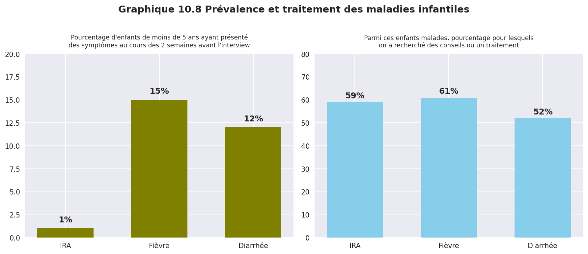
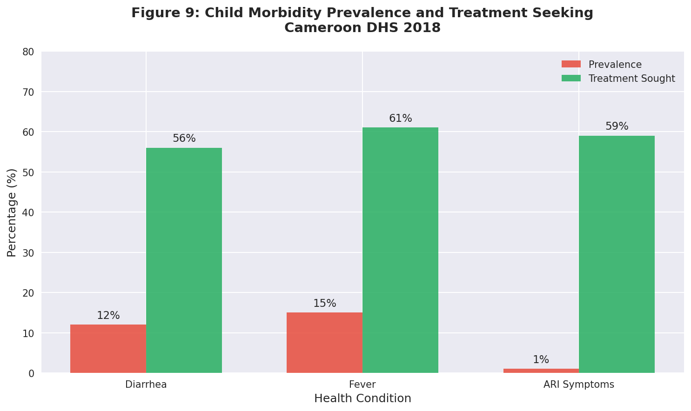
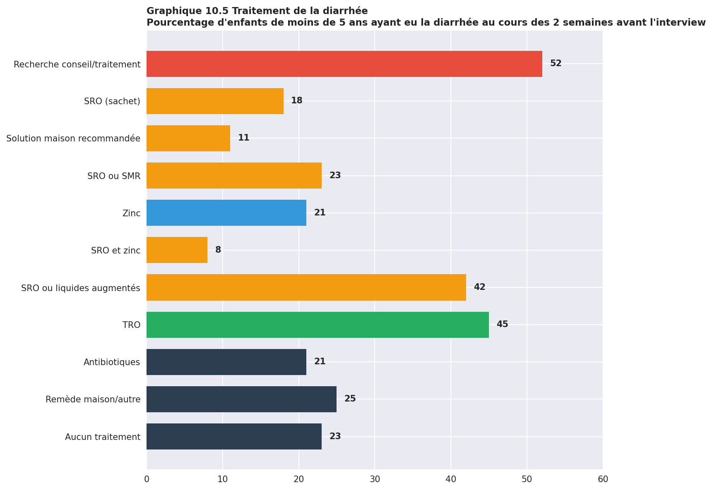
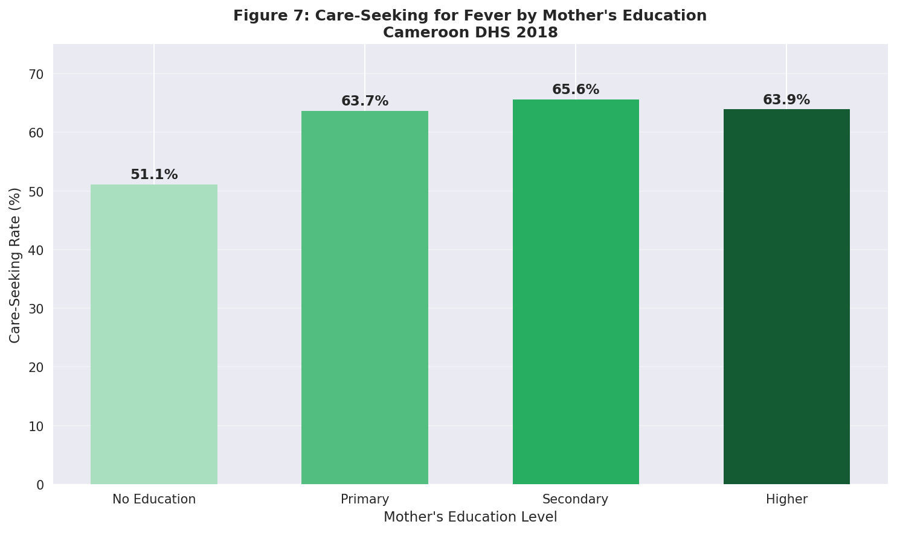
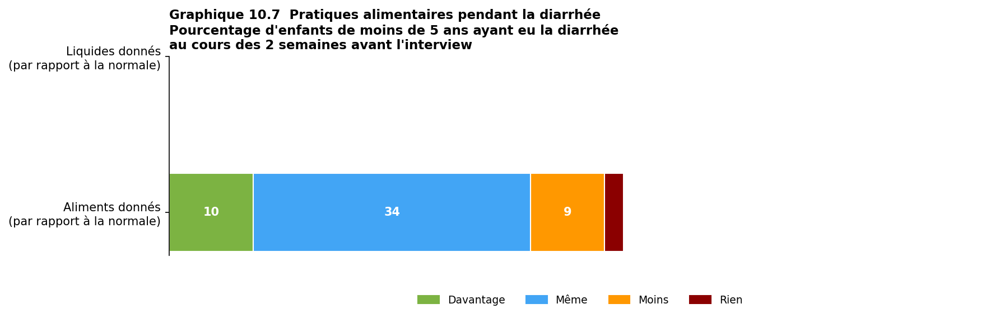
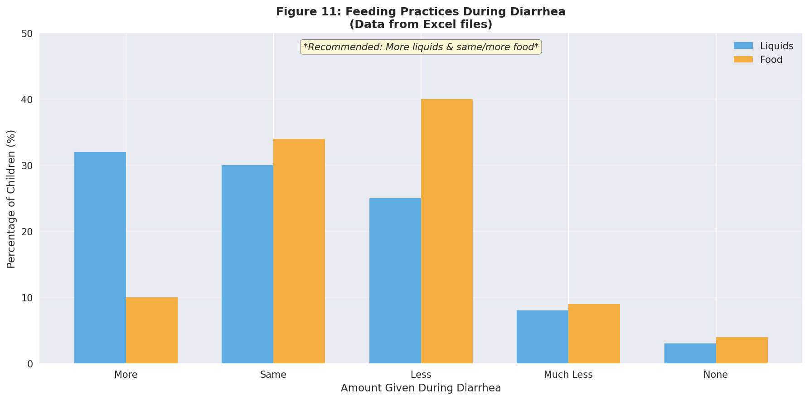
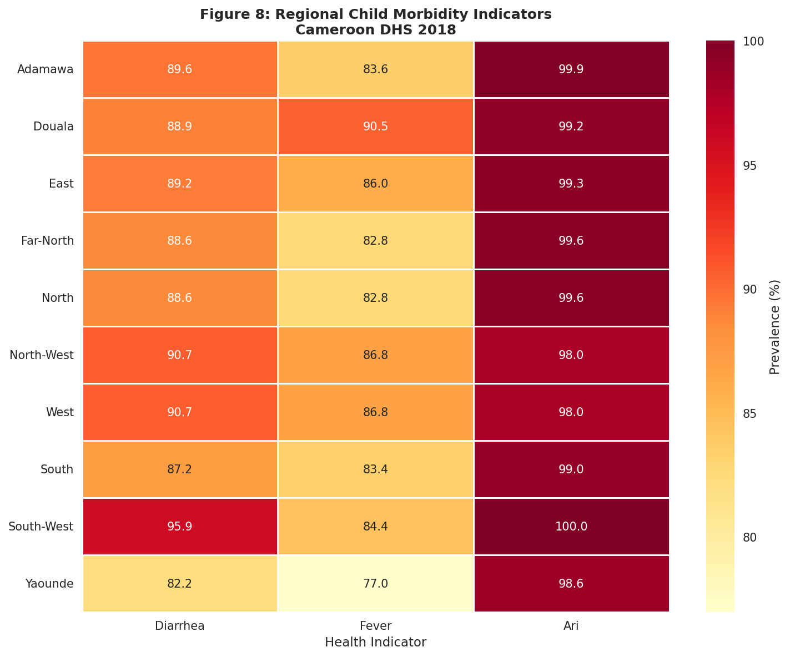

# Child Health Analysis Report
## Cameroon Demographic and Health Survey 2018

**Author:** Matrix Agent  
**Date:** January 2026  
**Data Sources:** Tables_DIAR.xls, Tables_ARI_FV.xls, Tables_Size.xls

---

## Executive Summary

This report presents a comprehensive analysis of child health indicators in Cameroon based on the 2018 Demographic and Health Survey (DHS). The analysis focuses on childhood morbidity (diarrhea, fever, and acute respiratory infections), treatment-seeking behaviors, and feeding practices during illness.

### Key Findings

| Indicator | Prevalence | Treatment Seeking |
|-----------|------------|-------------------|
| Diarrhea | 11.9% | 51.6% |
| Fever | 15.4% | 61.0% |
| ARI Symptoms | 1.0% | 59.2% |

---

## 1. Childhood Morbidity Overview

### 1.1 Prevalence of Childhood Illnesses

Among children under 5 years of age in Cameroon, the two-week prevalence rates were:

- **Fever:** 15.4% - the most common childhood illness
- **Diarrhea:** 11.9% - affecting approximately 1 in 8 children
- **ARI Symptoms:** 1.0% - relatively rare but potentially severe

*Graphique 10.8: Prévalence et traitement des maladies infantiles*

### 1.2 Treatment-Seeking Behavior

Treatment-seeking rates varied by illness type:
- **Fever:** 61.0% sought treatment (highest rate)
- **ARI:** 59.2% sought treatment
- **Diarrhea:** 51.6% sought treatment (lowest rate)

*Figure 9: Child Morbidity Prevalence and Treatment Seeking*

---

## 2. Diarrhea Deep Dive

### 2.1 Age-Specific Prevalence

Diarrhea prevalence follows a characteristic age pattern, peaking in the 6-23 month age range:

| Age Group | Prevalence |
|-----------|------------|
| <6 months | 5.0% |
| 6-11 months | 20.4% |
| 12-23 months | 21.1% |
| 24-35 months | 13.4% |
| 36-47 months | 7.7% |
| 48-59 months | 4.9% |

*Graphique 10.6: Prévalence de la diarrhée par âge*

### 2.2 Treatment Patterns

Various treatments were used for childhood diarrhea:

| Treatment | Percentage |
|-----------|------------|
| TRO (Oral Rehydration Therapy) | 44.6% |
| ORS or increased fluids | 42.0% |
| ORS (sachet) | 17.9% |
| Zinc | 20.6% |
| ORS and Zinc (combined) | 7.7% |
| No treatment | 23.4% |

*Graphique 10.5: Traitement de la diarrhée*

---

## 3. Socio-Economic Determinants

### 3.1 ORS Use by Wealth Quintile

Access to ORS treatment shows a clear wealth gradient:

| Wealth Quintile | ORS Rate |
|-----------------|----------|
| Poorest | 9.2% |
| Poorer | 12.5% |
| Middle | 19.3% |
| Richer | 21.8% |
| Richest | 29.9% |

*Figure 5: ORS Treatment for Diarrhea by Wealth Quintile*

### 3.2 Care-Seeking by Mother's Education

| Education Level | Care-Seeking Rate |
|-----------------|-------------------|
| No Education | 51.1% |
| Primary | 63.7% |
| Secondary | 65.6% |
| Higher | 63.9% |

*Figure 7: Care-Seeking for Fever by Mother's Education*

---

## 4. Feeding Practices During Illness

### 4.1 Fluid and Food Intake During Diarrhea

WHO recommends increasing fluids and maintaining food intake during diarrhea:

**Liquids given:**
- More: 32.3%
- Same: 30.1%
- Less: 25.2%
- None: 2.5%

**Food given:**
- More: 10.3%
- Same: 33.7%
- Less: 39.6%
- None: 3.9%

*Graphique 10.7: Pratiques alimentaires pendant la diarrhée*

*Figure 11: Feeding Practices During Diarrhea*

---

## 5. Regional Analysis

*Figure 8: Regional Child Morbidity Indicators*

---

## 6. Conclusions and Recommendations

### Key Findings:
1. **Fever** is the most prevalent childhood illness (15.4%)
2. **Diarrhea** peaks in children aged 6-23 months (21.1%)
3. **ORS treatment** shows significant wealth disparities (9.2% poorest vs 29.9% richest)
4. **Combined ORS+Zinc** use remains low at 7.7%

### Recommendations:
1. Target diarrhea prevention for 6-23 month age group
2. Improve ORS access in poorest wealth quintiles
3. Promote combined ORS+Zinc treatment
4. Educate caregivers on feeding practices during illness

---

## Data Sources

All data extracted from:
- `Tables_DIAR.xls` - Diarrhea prevalence and treatment
- `Tables_ARI_FV.xls` - ARI and Fever data
- `Tables_Size.xls` - Birth weight data

**Reference:** Cameroon Demographic and Health Survey 2018, Institut National de la Statistique (INS) and ICF.
